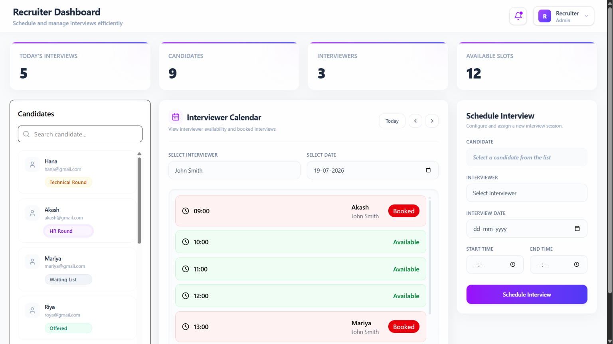

# Micro-ATS – Smart Interview Scheduler

A Full-Stack Interview sheduling application build with MERN stack that privents interviewer scheduling conflicts.

## Business Rules

- An interviewer cannot have overlapping interviews.
- Conflicting requests return HTTP 409.
- Interview times are stored in UTC.
- The frontend renders times in the user's local timezone.



## Tech Stack

Frontend
- React
- Tailwind CSS
- Axios

Backend
- Node.js
- Express.js
- MongoDB
- Mongoose

## Installation

### 1. Clone the repository

```bash
git clone https://github.com/shahanazz/micro-ats-system
```

### 2. Navigate into the project

```bash
cd backend
```


## 3. Environment Variables
```env
PORT=5000
MONGODB_URI=
```

### 4. Install dependencies

```bash
npm install
npm start
```
The application will be available at:

```
http://localhost:5000
```

## Frontend setup

```bash
cd ..
cd frontend
```

### 5. Install dependencies

```bash
npm install
npm start
```

The application will be available at:

```
http://localhost:5173
```
